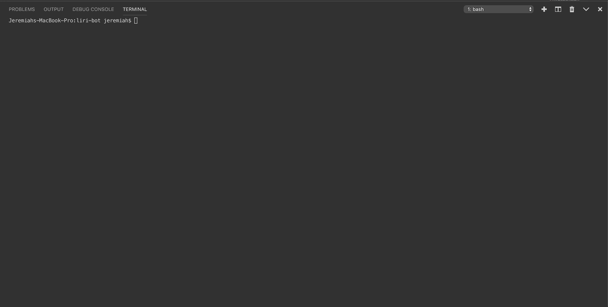

# liri-bot
The liri bot is a language interpretation program that has a few functions you can use via the CLI!

## movie-this

type `node liri.js movie-this <YOUR-MOVIE-HERE>`
This will search the omdb API and return the info of the movie you searched.

## spotify-this-song
type   `node liri.js spotify-this-song <YOUR-SONG-HERE>`
This will search the Spotify API and return info of the song you searched.

## concert-this
type `node liri.js concert-this <YOUR-ARTIST-QUERY-HERE>`
This will search the Bands In Town APU and return a list of upcoming shows from the artist you 
searched.

## do-what-it-says
type `node liri.js do-what-it-says`
This will read a file called `random.txt` that has instructions on what to run and will return, in this case, a backstreet boys song from spotify.

# MEMES!
Here are some funny commands that i have created!

type `node liri.js meme` to display a top tier meme created by yours truly, in the console!

type `node liri.js the-game` to play the game!

type `node liri.js meme-this <YOUR-MEME-QUERY-HERE>` to display one meme from a designated subreddit.

